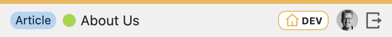

 
# Kirby Statusbar

The **Kirby Statusbar Plugin** adds a slim, fixed-position status bar to the bottom of the frontend. It displays environment-specific information useful for developers and editors.



## Features
- Current page title
- Page status (`draft`, `unlisted`, `listed`)
- Template name
- Logged-in user
- Environment indicator (DEV / STAGE / LIVE)
- Color-coded styling for environments

## Installation

### Via composer:
```bash
composer require chrfickinger/kirby-statusbar
```
### As a submodule
```bash
git submodule add https://github.com/chrfickinger/kirby-statusbar.git site/plugins/kirby-statusbar
```
### Or Download
Download and copy this repository to `/site/plugins/kirby-statusbar`.

## Configuration

The plugin comes with default values that can be customized in your `config.php`:

```php
return [
    'chrfickinger.kirby-statusbar' => [
        'active'      => true, // or false
        'environment' => 'staging',
        'color'       => '#e8b860'
    ]
];
```

## Credits
Inspired by [Kirby Admin Bar](https://github.com/Pechente/kirby-admin-bar) – thanks for the initial idea.